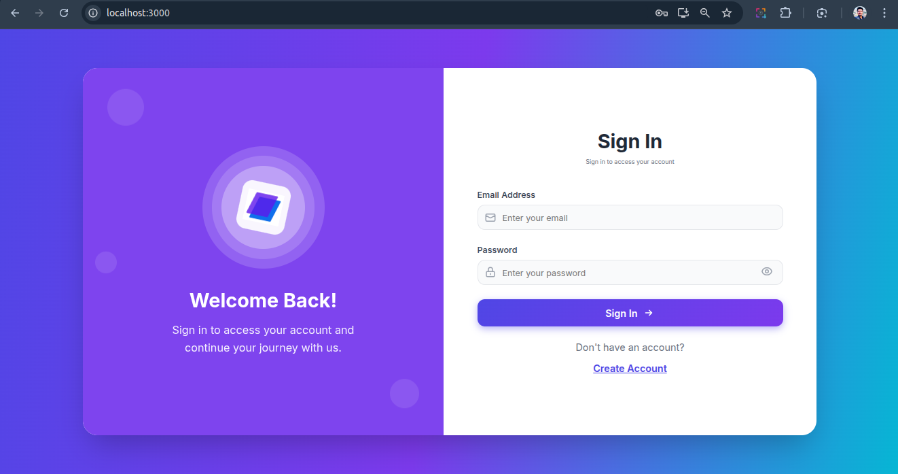

# Steps to runserver:



```bash
cd backend/
sudo apt update
sudo apt install python3-venv
python3 -m venv myenv
source myenv/bin/activate
mysql -u root
ALTER USER 'root'@'localhost' IDENTIFIED WITH mysql_native_password BY 'Prachi@8287';
FLUSH PRIVILEGES;
EXIT;
sudo systemctl start mysql
python3 manage.py migrate
python3 manage.py createsuperuser
python3 manage.py runserver

# (in seperate terminal, run frontend)
npm install
npm start
# Open http://localhost:3000/
```

* MySQL setup
* Django backend setup
* React frontend setup
* API integration details
* Common troubleshooting steps

---

### ✅ `README.md`

```markdown
# ERP System – Django + React

A full-stack ERP system with:

- 🧠 Django REST API backend
- 💻 React frontend
- 🛢️ MySQL database

---

## 📦 Project Structure

```

Integration-main/
├── backend/      # Django project
├── frontend/     # React frontend
└── README.md

````

---

## 🧰 Prerequisites

- Python 3.10+
- Node.js 16+
- MySQL 8.x
- pip / venv / npm

---

## 1️⃣ MySQL Setup

1. **Login to MySQL**:

```bash
mysql -u root -p
````

2. **Create the database**:

```sql
CREATE DATABASE erp CHARACTER SET utf8mb4 COLLATE utf8mb4_unicode_ci;
```

3. **Create a new user (optional)**:

```sql
CREATE USER 'django_user'@'localhost' IDENTIFIED BY 'Test@1234';
GRANT ALL PRIVILEGES ON erp.* TO 'django_user'@'localhost';
FLUSH PRIVILEGES;
```

> Or use `root` if you're okay with it for local dev.

---

## 2️⃣ Django Backend Setup

```bash
cd backend
python3 -m venv myenv
source myenv/bin/activate
pip install -r requirements.txt
```

### 🔧 Update `core/settings.py`

Make sure `DATABASES` in `settings.py` reflects your credentials:

```python
DATABASES = {
    'default': {
        'ENGINE': 'django.db.backends.mysql',
        'NAME': 'erp',
        'USER': 'django_user',         # or 'root'
        'PASSWORD': 'Test@1234',       # match your MySQL setup
        'HOST': 'localhost',
        'PORT': '3306',
        'OPTIONS': {
            'init_command': "SET sql_mode='STRICT_TRANS_TABLES'",
            'charset': 'utf8mb4',
        }
    }
}
```

### 🛠 Run migrations and create superuser

```bash
python3 manage.py makemigrations
python3 manage.py migrate
python3 manage.py createsuperuser
```

### ▶️ Start Django server

```bash
python3 manage.py runserver
```

Runs at: **[http://localhost:8000](http://localhost:8000)**

---

## 3️⃣ React Frontend Setup

```bash
cd ../frontend
npm install
```

### 🌐 Configure backend API URL

Create a `.env` file:

```env
REACT_APP_API_URL=http://localhost:8000
```

### ▶️ Start React frontend

```bash
npm start
```

Runs at: **[http://localhost:3000](http://localhost:3000)**

---

## 🔐 API Auth Notes

* Uses `TokenAuthentication` and `BasicAuthentication`
* Public APIs (`/accounts/api/register/`, `/accounts/api/login/`) are open with `AllowAny`
* Protected APIs require token or session

---

## ✅ Key Endpoints (Backend)

| Endpoint                       | Auth Required | Description              |
| ------------------------------ | ------------- | ------------------------ |
| `POST /accounts/api/register/` | ❌ No          | Register user & company  |
| `POST /accounts/api/login/`    | ❌ No          | Login, returns user data |
| `GET /accounts/api/user/`      | ✅ Yes         | Authenticated user info  |
| `POST /accounts/api/logout/`   | ✅ Yes         | Logout user              |

---

## ⚠️ Common Issues & Fixes

### ❌ API error: No response received

* ✅ Ensure Django is running on port 8000
* ✅ Confirm `CORS_ALLOWED_ORIGINS` in `settings.py` includes `http://localhost:3000`
* ✅ Ensure public APIs use `permission_classes = [AllowAny]`

### ❌ "Unknown database 'erp'"

Run in MySQL:

```sql
CREATE DATABASE erp CHARACTER SET utf8mb4 COLLATE utf8mb4_unicode_ci;
```

---

## 🧪 Development Notes

* Django debug mode is ON (`DEBUG = True`)
* Static files served via Whitenoise in dev
* Templates are **not used** — React handles all UI

---

## 🙋‍♀️ Maintainers / Contributors

* [Your Name](mailto:your.email@example.com)

---

## 📄 License

MIT (or whichever license applies)

```

---

Let me know if you'd like to auto-generate `.env` templates, Docker support, or deployment instructions (e.g., PythonAnywhere or Heroku).
```
